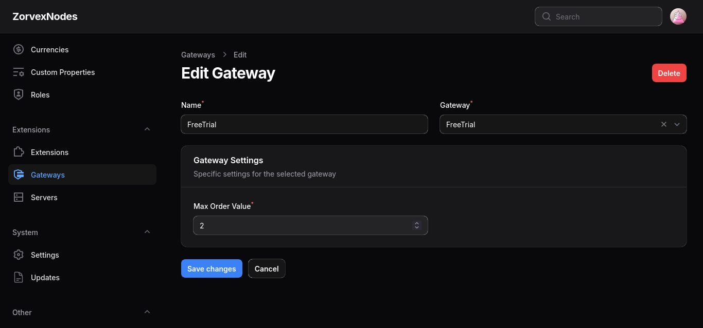

# Free Trial Payment Gateway for Paymenter

A simple extension for [Paymenter](https://paymenter.org) that allows automatic invoice approval for orders under a configurable maximum value. Ideal for offering **free trials** or promotional services with zero friction.

## Supported Versions
> The last version which supported Paymenter v0.9.5 is [v1.0.0](https://github.com/VaibhavSys/FreeTrial-Paymenter-Extension/releases/tag/v1.0.0)
- **Supported Version:** Paymenter v1.0.4
- **Extension Version:** v2.0.0

## Features
- Automatically approves invoices if the total is under a configured maximum value.
- Seamless free trial support — no real payment is processed.
- Lightweight and easy to configure.

> ⚠️ **Note:** This gateway cannot be used to credit user accounts. It only applies to invoices which do not add credits to a user account.

## How It Works

Once enabled, if a user attempts to pay an invoice and the total amount is **less than or equal to** the configured **Max Order Value**, the payment is **automatically marked as paid**. If the amount exceeds the limit, the payment is **rejected**.

This gives you full flexibility to:
- Create promotional plans priced under the trial limit.
- Use one-time coupons and products to offer free trials.
- Test services internally without actual transactions.

## Getting Started

1. **Install the extension**
   - Replace `/var/www/paymenter` with your actual Paymenter installation path.
   - **One-liner Install:**
     ```sh
     git clone https://github.com/VaibhavSys/FreeTrial-Paymenter-Extension.git /var/www/paymenter/extensions/Gateways/FreeTrial
     ```
   - **Manual Install:**
     [Download](https://github.com/VaibhavSys/FreeTrial-Paymenter-Extension/releases/latest/download/FreeTrial.zip) the extension and extract it to:
     ```
     /var/www/paymenter/extensions/Gateways
     ```
1. **Enable the extension** from the Paymenter admin panel.
1. **Configure the Max Order Value** in the admin panel (e.g., `0.5` to allow automatic approval for invoices ≤ $0.5).

That’s it — you’re ready to offer free trials!

## Configuration

- **Max Order Value (number):** The maximum invoice amount (in your invoice currency) that can be auto-approved. Any invoice above this value will be rejected.



> 💡 If you want to use this with a one-time promotional coupon/product, ensure the final payable invoice amount (after discount) is within the Max Order Value.

## Support

For questions, suggestions, or issues:
- **Discord:** [@vaibhavd](https://discord.com/users/914452175839723550)
- **GitHub Issues:** [FreeTrial-Paymenter Issues](https://github.com/VaibhavSys/FreeTrial-Paymenter-Extension/issues)

## Additional Information

- **License:** MIT — see [LICENSE](LICENSE) for details.
